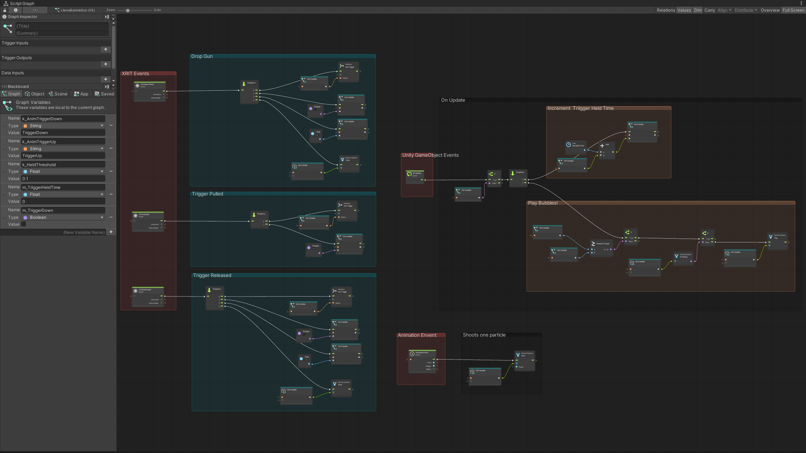
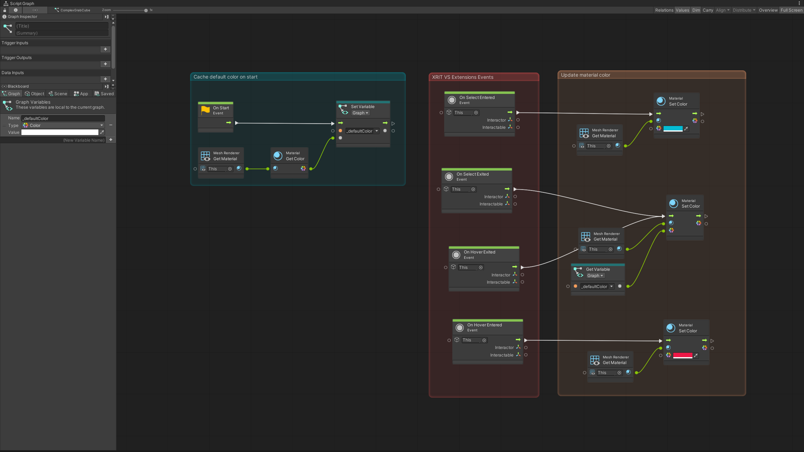
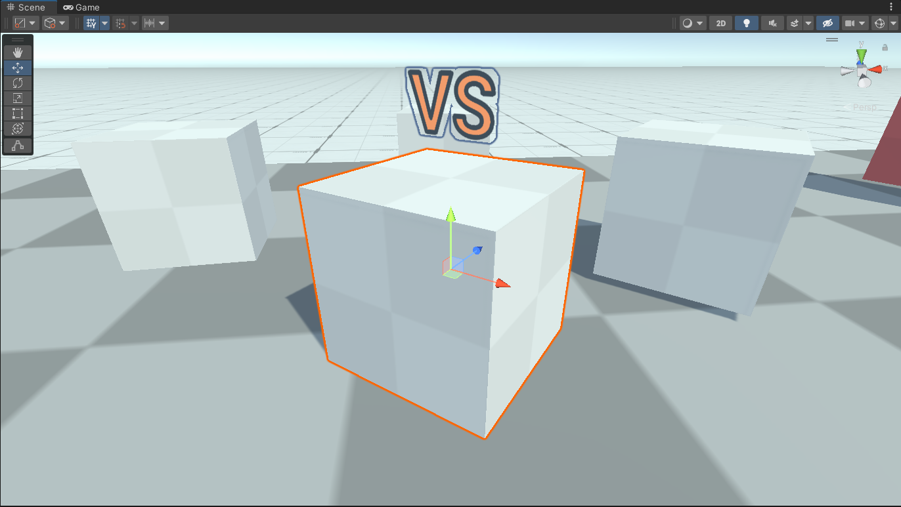

# XR Interaction Toolkit Examples

This fork of the XR Interaction Toolkit (XRIT) Examples is part of the [Road to Metaverse, Creator Series](https://create.unity.com/road-to-metaverse), it uses [XRIT Pacakage](https://docs.unity3d.com/Packages/com.unity.xr.interaction.toolkit@latest) and [Visual Scripting extensions for XR Interaction Toolkit](https://github.com/jeromemaurey/VisualScripring.Extensions.XRIT) to explore integrating XRIT with Unity's Visual Scripting.

 

## Warning!
> This is an **experimental** project developed by **me**, not Unity.

 

# What was done!
Currently I have only tested the **VR** example, and re-created the following scripts in the `WorldInteractionDemo` scene with Visual Scripting:

## BubbleGun -> VSBubbleGun

## ComplexCube -> VSComplexCube

 

## Items in the scene using visual scripts have a `VS` label over them.

